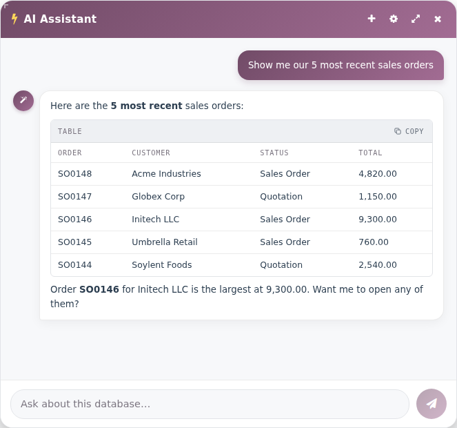
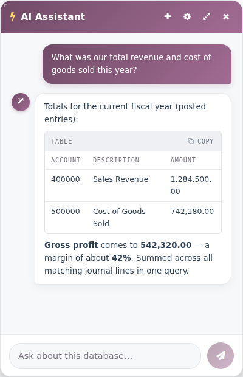
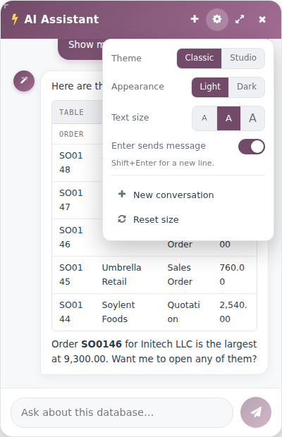
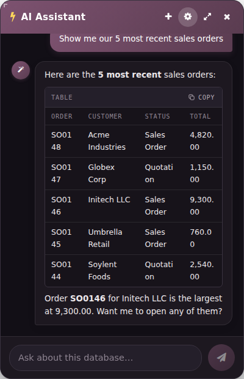

# AI Assistant for Odoo

An agentic AI assistant docked in the Odoo backend. Ask it about your live database in plain
language — it reads records, totals figures, and (with your confirmation) creates, edits, and runs
workflow actions, all as the logged-in user and always within Odoo's access rights.

Runs on **your own choice of AI** — OpenAI, Anthropic (Claude), a local [Ollama](https://ollama.com)
model for privacy, Amazon Bedrock, or any OpenAI-compatible endpoint (Groq, OpenRouter, vLLM…).
Works on **Odoo 17, 18 and 19**.

<p align="center">
  
</p>

## What it can do

- **Answer from your data** — "How many contacts do we have?", "Show the 5 most recent sale orders."
- **Totals & reporting** — sums, averages and counts computed in the database (e.g. revenue and COGS
  for a period, grouped by account), not by reading thousands of rows.

  

- **Create & edit** — draft a sales order, update a field, translate a record.
- **Run workflow actions** — confirm a sales order, post an invoice, validate a delivery, set a
  record back to draft. Only a curated set of safe workflow buttons is allowed (see *Security*).
- **Always with a confirmation step** — anything that changes, runs, or deletes is **proposed first**
  and only executed after you explicitly confirm.
- **Renders cleanly** — Markdown tables and code with one-click copy; every answer is sanitised HTML.
- **Adjustable panel** — two themes, per-window light/dark, text size, and a resizable, draggable
  window. Preferences persist per browser.

<p align="center">
  
  &nbsp;&nbsp;
  
</p>

### The tools it uses

| Tool | Purpose |
|---|---|
| `get_model_schema` | Inspect a model's fields |
| `read_odoo_records` | Search & read (paged) |
| `count_odoo_records` | Exact counts |
| `aggregate_odoo_records` | SUM / AVG / MIN / MAX / COUNT, with group-by |
| `create_odoo_record` | Create a record |
| `update_odoo_records` | Update *(confirmation required)* |
| `update_odoo_record_translations` | Field translations *(confirmation required)* |
| `delete_odoo_records` | Delete *(confirmation required)* |
| `run_odoo_action` | Run a workflow button, e.g. confirm/post/validate *(confirmation required)* |
| `confirm_pending_action` / `cancel_pending_action` | Execute or drop a proposed change |

## Security

- Every tool runs **as the logged-in user** and calls Odoo's `check_access` — the assistant can
  never see or touch what that user couldn't.
- **Confirmation gate** — updates, translations, deletes and actions are proposed with a count of
  affected records and only run after the user confirms in their own words. The gate is
  code-enforced: the model cannot approve its own proposal in the same turn.
- **`run_odoo_action` is an allowlist, not "call any method."** Only a small, curated set of no-argument
  workflow buttons is exposed (`action_confirm`, `action_post`, `action_cancel`, `action_draft`,
  `button_confirm`, `button_validate`, …). Arbitrary method calls are refused, so the assistant can't
  read secrets, grant access, send mail, or bypass ACLs. The list lives in `METHOD_ALLOWLIST` and is
  easy to extend per deployment.
- A **model blocklist** keeps the assistant away from sensitive models (payments, users, mail
  servers, config parameters, …) for any change or action.

> Multi-step confirmations are only as reliable as the model driving them. A capable tool-calling
> model (GPT-4o, Claude, or a strong local model) is recommended for create/update/action flows.

## Requirements

- Odoo 17 / 18 / 19
- Python 3.10+
- An AI backend: an OpenAI/Anthropic API key, a local Ollama server, Amazon Bedrock, or any
  OpenAI-compatible endpoint
- Python packages in [`odoo_ai_chatbot/requirements.txt`](odoo_ai_chatbot/requirements.txt)

## Install

```bash
# 1. Clone into your Odoo addons directory
cd /path/to/your/addons
git clone https://github.com/NullNaveen/odoo-ai-assistant.git

# 2. Install the Python dependencies (into the same environment Odoo runs in)
pip install -r odoo-ai-assistant/odoo_ai_chatbot/requirements.txt

# 3. Make sure the addons path includes the cloned folder, e.g. in odoo.conf:
#    addons_path = ...,/path/to/your/addons/odoo-ai-assistant
```

Then in Odoo: **Apps → Update Apps List**, search **AI Assistant**, and click **Install**.

> The module's technical name is `odoo_ai_chatbot` — keep that folder name in the addons path.

## Configure

Open **Settings → AI Assistant** and pick a provider. In most cases you fill in just three fields:

| Provider | API Key | Model | Base URL |
|---|---|---|---|
| **OpenAI** | your key | `gpt-4o-mini` | — |
| **Anthropic (Claude)** | your key | `claude-3-5-sonnet-latest` | — |
| **Ollama** (local) | *(optional)* | `qwen3:latest` | `http://localhost:11434` |
| **OpenAI-compatible** | your key | provider's model id | the endpoint URL |
| **Amazon Bedrock** | AWS keys | model id | — |

Then open the assistant from the **wand icon** in the systray (top bar) of the Odoo backend.

> Use a **tool-calling capable** model — the assistant relies on function calling to use its tools.

## Credits

Based on the original **AI Chatbot** by [Tarang Kushwaha](https://github.com/tarang7651/odoo_ai_chatbot),
substantially extended: aggregation, workflow actions, multi-provider support, a code-enforced
confirmation gate, security hardening, Markdown rendering, and a themed, resizable UI.

## License

[LGPL-3](LICENSE).
