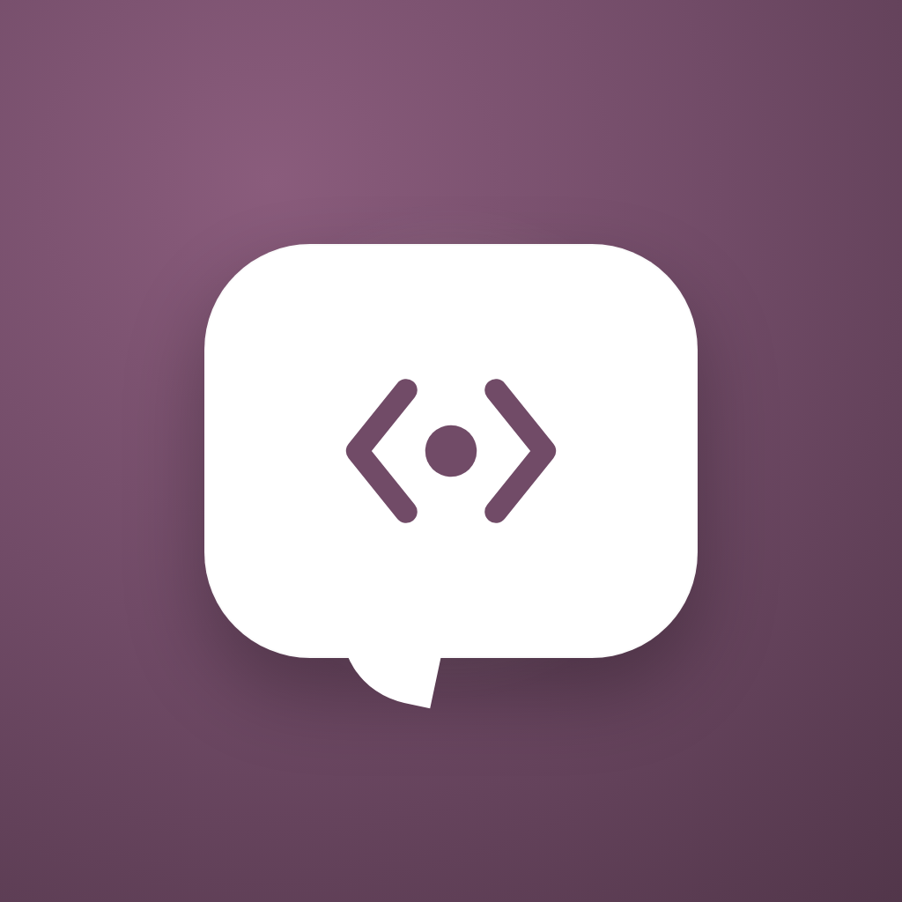
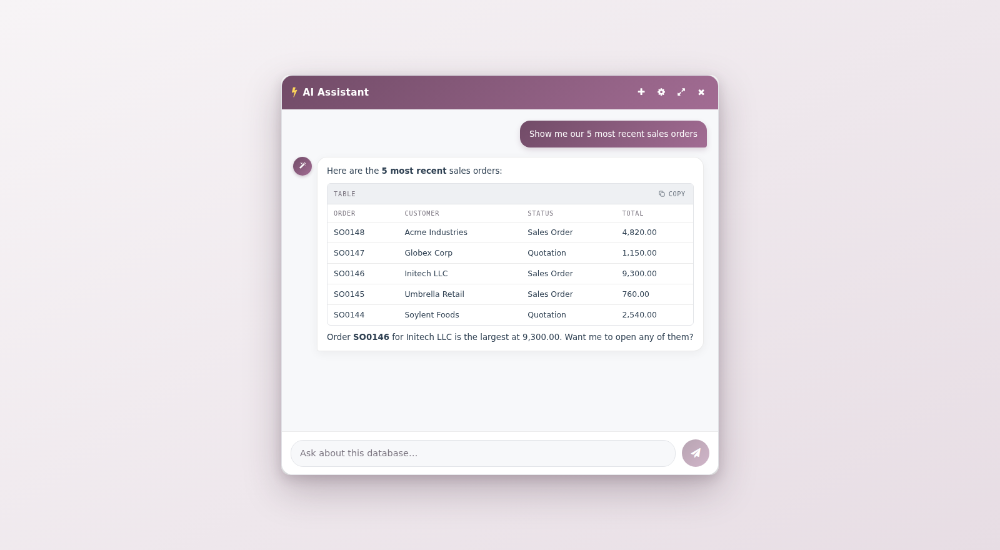
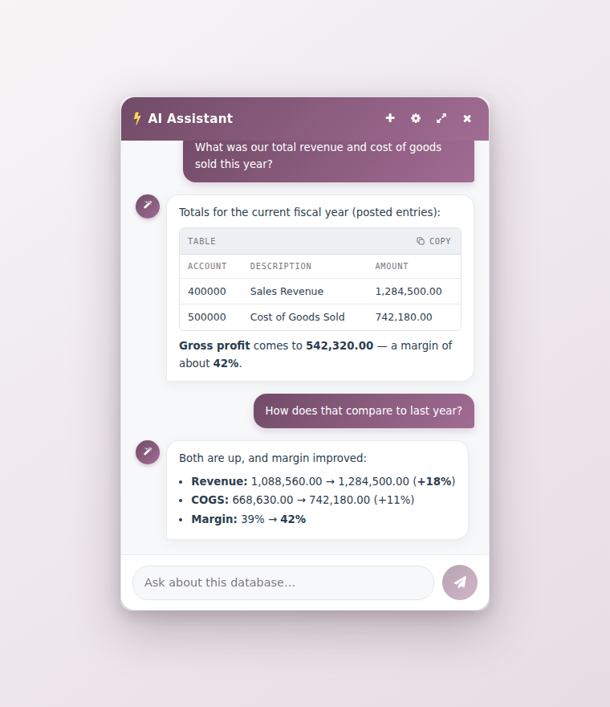
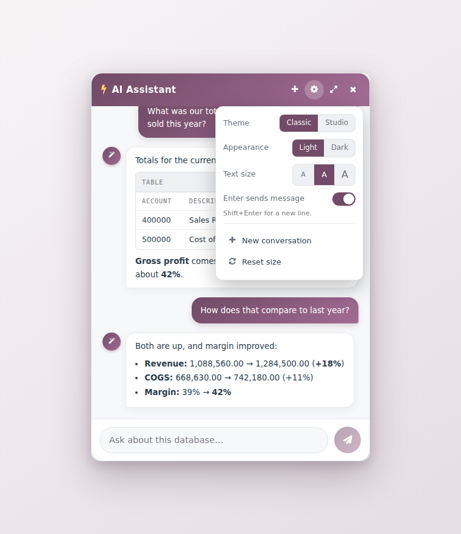
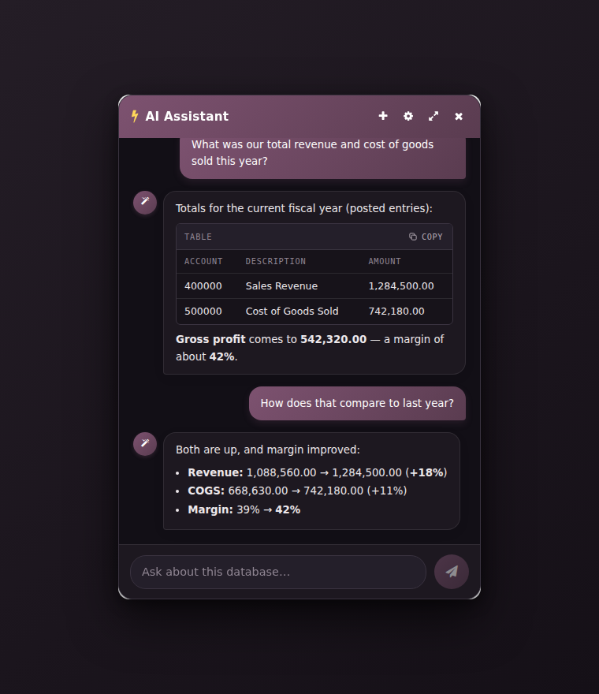

<div align="center">



# AI Assistant for Odoo

**Ask your database anything. Get answers, totals, and actions — with your own AI.**

[](#requirements)
[](LICENSE)
[](#configure)



</div>

An agentic assistant docked in the Odoo backend. It answers questions from your live database in
plain language — and with your confirmation it creates records, edits them, and runs workflow
actions. Always as the logged-in user, always within Odoo's access rights.

## Highlights

- **Answers from your data** — "How many contacts do we have?", "Show the 5 most recent sale orders."
- **Knows what's on your screen** — ask "what am I looking at?" or say "confirm this order" and it
  resolves to the record you have open (privacy toggle in settings).
- **Totals & reporting** — sums, averages and counts computed in the database with one query
  (revenue, COGS, margins — grouped by account, month, anything), never by paging thousands of rows.
- **Creates & edits** — draft a sales order, update a field, translate a record.
- **Runs workflow actions** — confirm an order, post an invoice, validate a delivery, cancel, reset
  to draft. Only a curated set of safe buttons (see [Security](#security)).
- **Asks before acting** — every change is proposed first with the exact record count, and only runs
  after you explicitly confirm.
- **Conversation history** — every chat is kept: search, switch, rename and delete past
  conversations, with titles taken from your first question.
- **Reads beautifully** — Markdown tables and code blocks with one-click copy, sanitised HTML.
- **Feels native** — five themes (Classic, Ocean, Sunset, Studio, and a mono Terminal), per-window
  light/dark, three text sizes, resizable panel. Preferences persist per browser.

<div align="center">

| Database totals in one query | Quick settings | Dark mode |
|:---:|:---:|:---:|
|  |  |  |

</div>

## The tools it uses

| Tool | Purpose |
|---|---|
| `get_model_schema` | Inspect a model's fields |
| `read_odoo_records` | Search & read (paged) |
| `count_odoo_records` | Exact counts |
| `aggregate_odoo_records` | SUM / AVG / MIN / MAX / COUNT, with group-by |
| `create_odoo_record` | Create a record |
| `update_odoo_records` | Update *(confirmation required)* |
| `update_odoo_record_translations` | Field translations *(confirmation required)* |
| `delete_odoo_records` | Delete *(confirmation required)* |
| `run_odoo_action` | Workflow buttons: confirm / post / validate / cancel *(confirmation required)* |
| `confirm_pending_action` / `cancel_pending_action` | Execute or drop a proposed change |

## Security

- Every tool runs **as the logged-in user** and passes Odoo's `check_access` — the assistant can
  never see or touch what that user couldn't.
- **Code-enforced confirmation gate** — changes are proposed with the affected record count and only
  execute after the user approves in a *later* message. The model cannot confirm its own proposal
  in the same turn.
- **`run_odoo_action` is an allowlist, not "call any method."** Only audited, no-argument workflow
  buttons (`action_confirm`, `action_post`, `action_cancel`, `action_draft`, `button_validate`, …)
  are callable — so the assistant can't read secrets, grant access, send mail, or bypass ACLs.
  The list lives in `METHOD_ALLOWLIST`, one line to extend per deployment.
- A **model blocklist** keeps writes and actions away from sensitive models (payments, users,
  mail servers, config parameters, …).

> Multi-step confirmations are only as reliable as the model driving them. A capable tool-calling
> model (GPT-4o, Claude, or a strong local model) is recommended for create/update/action flows.

## Requirements

- Odoo 17 / 18 / 19 · Python 3.10+
- An AI backend: an OpenAI or Anthropic API key, a local Ollama server, Amazon Bedrock, or any
  OpenAI-compatible endpoint
- Python packages from [`odoo_ai_chatbot/requirements.txt`](odoo_ai_chatbot/requirements.txt)

## Install

```bash
# 1. Clone into your Odoo addons directory
cd /path/to/your/addons
git clone https://github.com/NullNaveen/odoo-ai-assistant.git

# 2. Install the Python dependencies (same environment Odoo runs in)
pip install -r odoo-ai-assistant/odoo_ai_chatbot/requirements.txt

# 3. Add the folder to your addons path (odoo.conf):
#    addons_path = ...,/path/to/your/addons/odoo-ai-assistant
```

Then in Odoo: **Apps → Update Apps List** → search **AI Assistant** → **Install**.

> The module's technical name is `odoo_ai_chatbot` — keep that folder name inside the repo.

## Configure

**Settings → AI Assistant.** Pick a provider, and in most cases fill exactly three fields:

| Provider | API Key | Model | Base URL |
|---|---|---|---|
| **OpenAI** | your key | `gpt-4o-mini` | — |
| **Anthropic (Claude)** | your key | `claude-3-5-sonnet-latest` | — |
| **Ollama** (local, private) | *(optional)* | `qwen3:latest` | `http://localhost:11434` |
| **OpenAI-compatible** (Groq, OpenRouter, vLLM, LM Studio…) | if required | provider's model id | endpoint URL |
| **Amazon Bedrock** | AWS keys | model id | — |

Open the assistant from the **wand icon** in the systray, or the **AI Chatbot** app tile.

> Use a **tool-calling capable** model — the assistant relies on function calling for everything it does.

## Credits

Based on the original **AI Chatbot** by [Tarang Kushwaha](https://github.com/tarang7651/odoo_ai_chatbot),
substantially extended: aggregation, workflow actions, multi-provider support, a code-enforced
confirmation gate, security hardening, Markdown rendering, and a themed, resizable UI.

## License

[LGPL-3](LICENSE)
